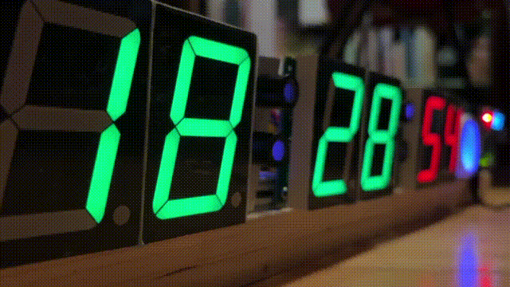
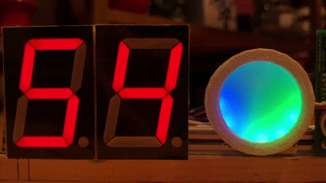
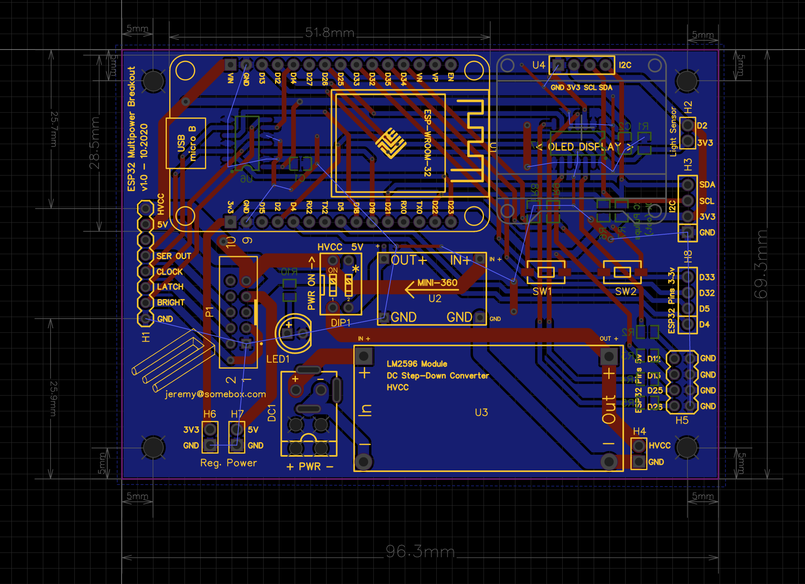
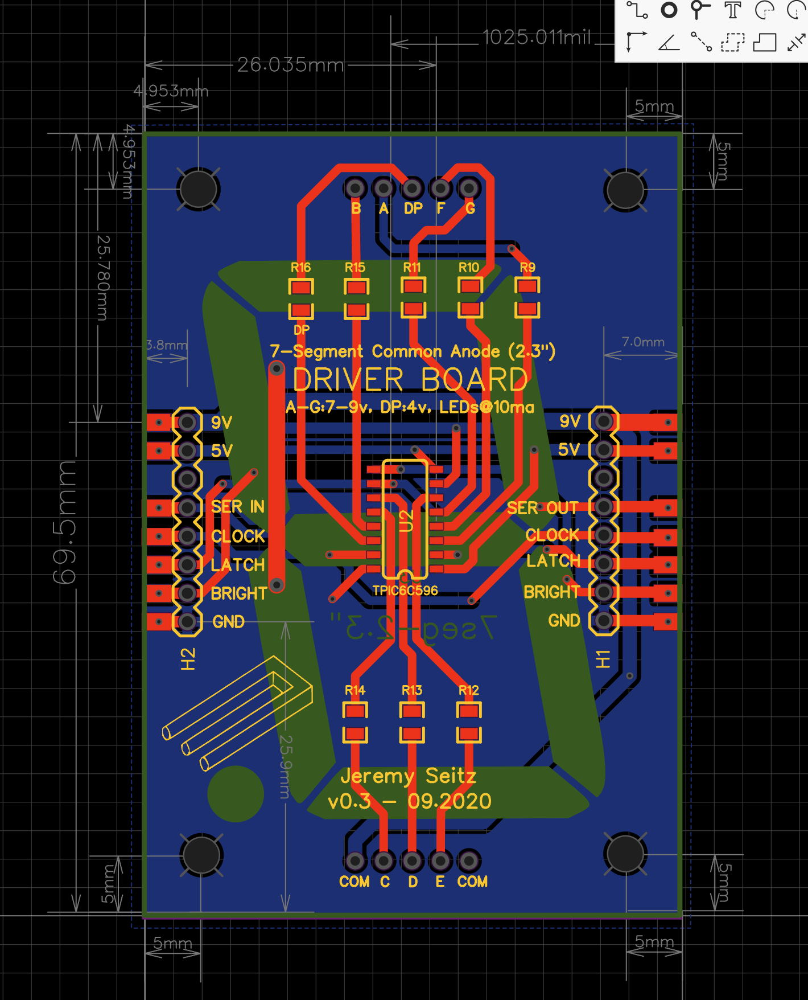
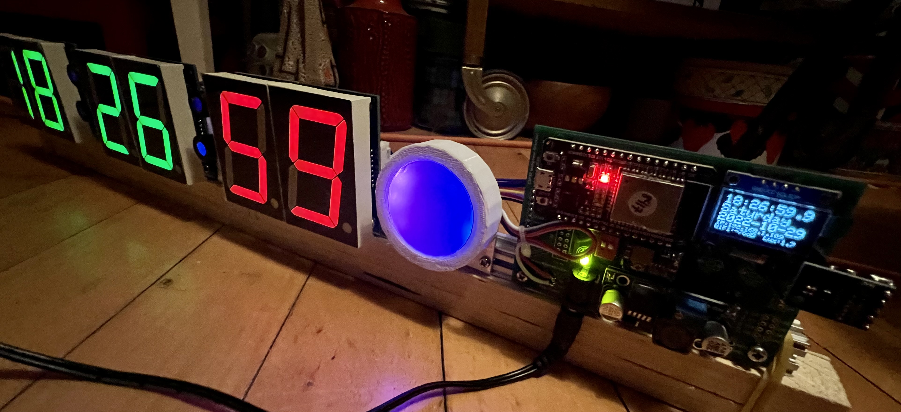
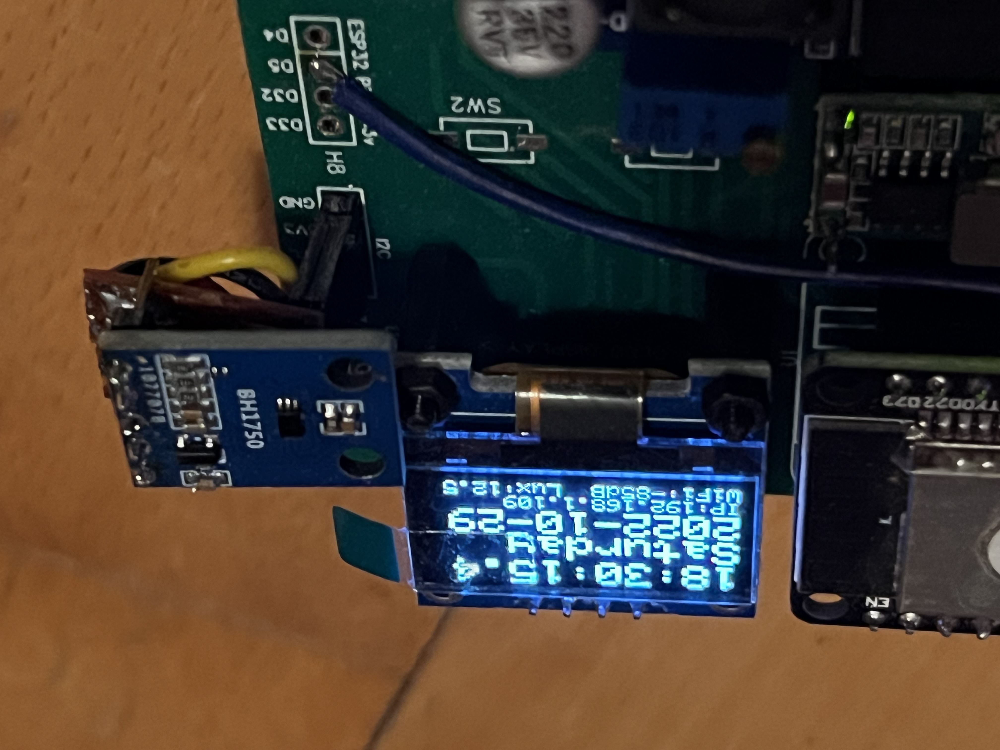
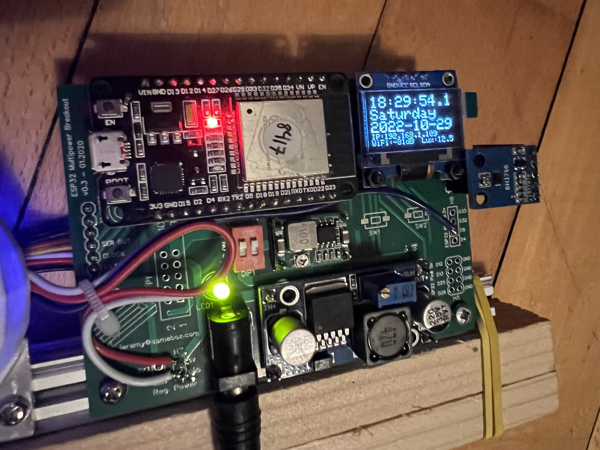
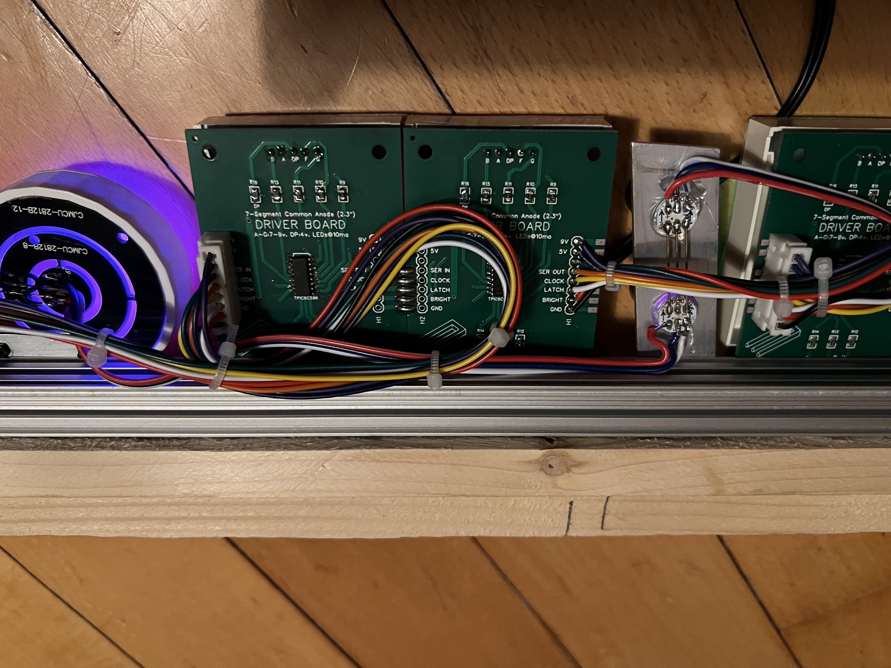

# ESP32 Cyberclock

I decided one day to make a clock using old-school 2.3" LED 7-segment displays. Which I happen to have a lot of. After hacking on it for a few weekends, it ended up being this:

- 7 circuit boards and three custom mounted sections, mounted to an aluminum frame, about 600mm wide
- An ESP32 WROOM32 devkit board
- custom power board PCB for the ESP32, which provides a DC high voltage rail, 5v, 3.3v, level shifting (74HCT125n) and various breakout headers
- 6x 2.3" 7-segment displays (running at ~7v, 10-pin common anode modules)
- each digit is mounted on a custom PCB with a high-current LED driver chip and connected via JST cables in serial.
- WS2812b 5050 LEDs are used for the circular effect (a common pbc, with 3d-printed mount), and the custom separator dot panels, all of which are mounted with hand-machined aluminum sections
- An I2C ambient light meter, so the clock can adjust brightness automatically
- A small OLED display shows the time, date, IP address, wifi strength and light level (lux)
- The clock is powered with 9v DC wall plug, which gets stepped down to around 7v (for the 2.3" digits), and then 5v for the ESP32 board and LEDs.

## The Code

The code for this clock has been a journey. There are a lot of things going on at the same time, animations at different speeds, and periodic changes. At first, I was hacking this counting interations and tweaking, but it soon became clear this was causing problems. This led to some frustrated rewrites and a lot of learning.

I decided to give [NeoPixelBus](https://github.com/Makuna/NeoPixelBus) a try, which I had been using for basic things, and discovered the [NeoPixelAnimator](https://github.com/Makuna/NeoPixelBus/wiki/NeoPixelAnimator-object) object. Unline other periodic timer libraries, NeoPixelAnimator can manage multiple repeating animation cycles, and uses call backs with progress indication. It also has built-in easing functions, which helps make things feel more organic. 

This repository contains the firmware for the clock as well as various pictures, drawings and schematics, in case you want to make something similar.

## Schematics

Both PCB Projects and designs used are available here:
- https://oshwlab.com/outfigurable/esp32-controller-w-power
- https://oshwlab.com/outfigurable/2-3in-tpic6c596

### The dual-rail power board with level shifting
A 2.3mm barrel jack power connector feeds 9-12v into an adjustable buck converter, which produces ~7v DC line for the 7-segment modules. A second buck converter turns that into 5v, which feeds the microcontroller, WS2812 LEDs, and the 5v line going to the modules for the driver ICs. The regulator on the ESP32 produces 3.3v which is also available on-board for the display and sensors. The board has a couple of DIP switches in case you ever need to disable one of the two power rails for troubleshooting.

### The LED 7-segment digit driver board (common anode, TPIC6C596)
Each board sports a TPIC6C596 driver IC (similar to standard "595" chips, but with much higher current handling) and current-limiting resistors for each LED in the digit. In this configuration, HVCC DC power at ~7v and 5v are both supplied to the digit modules. Note that red and green modules have different power requirements, so the resistors on the boards are tweaked accordingly.

## Some Pictures

